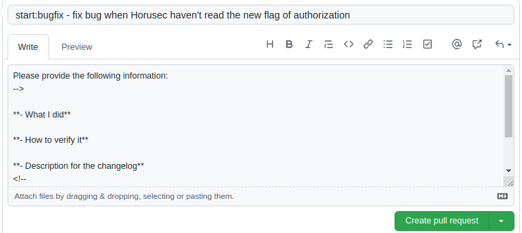

# **Contributing Guide**

This is Horusec contributing guide. Please read the following sections to learn how to ask questions and how to work on something.

## **Table of contents**
### 1. [**Before you contribute**](#before-you-contribute)
> #### 1.1. [**Code of Conduct**](#code-of-conduct)
> #### 1.2. [**Legal**](#legal)
### 2. [**Prerequisites**](#prerequisites)
> #### 2.1. [**Developer Certificate of Origin**](#developer-certificate-of-origin)
> #### 2.2. [**Code Review**](#code-review)
> #### 2.3. [**Issues**](#issues)
> ##### 2.3.1. [**Check the issue tracker**](#check-the-issue-tracker)
> ##### 2.3.2. [**Open an issue for any new problem**](#open-an-issue-for-any-new-problem)
> #### 2.4. [**Pull Requests**](#pull-requests)    
### 3. [**How to contribute?**](#how-to-contribute?)
 > #### 3.1. [**Prepare your development environment**](#prepare-your-development-environment)
> #### 3.2. [**First contribution**](#first-contribution)
> #### 3.3. [**Add new feature, bug fixing or improvement**](#add-new-feature-bugfixing-or-improvement)
> #### 3.4. [**Pull Request's approval**](#pull-request-approval)
> #### 3.5. [**After your pull request's approval**](#after-your-pull-request-approval)
### 4. [**Community**](#community)

## **Before you contribute**

### **Code of Conduct**
Please follow the [**Code of Conduct**](https://github.com/ZupIT/horusec/blob/main/CODE_OF_CONDUCT.md) in all your interactions with our project.

### **Legal**
- Horusec is licensed over [**ASF - Apache License**](https://github.com/ZupIT/horusec/blob/main/LICENSE), version 2, so new files must have the ASF version 2 header. For more information, please check out [**Apache license**](https://www.apache.org/licenses/LICENSE-2.0).

- All contributions are subject to the [**Developer Certificate of Origin (DCO)**](https://developercertificate.org). 
When you commit, use the ```**-s** ``` option to include the Signed-off-by line at the end of the commit log message.

## **Prerequisites**
Check out the requisites before contributing to Horusec:

### **Developer Certificate of Origin - DCO**

 This is a security layer for the project and for the developers. It is mandatory.
 
 Follow one of these two methods to add DCO to your commits:
 
**1. Command line**
 Follow the steps: 
 **Step 1:** Configure your local git environment adding the same name and e-mail configured at your GitHub account. It helps to sign commits manually during reviews and suggestions.

 ```
git config --global user.name “Name”
git config --global user.email “email@domain.com.br”
```
**Step 2:** Add the Signed-off-by line with the `'-s'` flag in the git commit command:

```
$ git commit -s -m "This is my commit message"
```
**2. GitHub website**

You can also manually sign your commits during GitHub reviews and suggestions, follow the steps below: 

**Step 1:** When the commit changes box opens, manually type or paste your signature in the comment box, see the example:

```
Signed-off-by: Name < e-mail address >
```

For this method, your name and e-mail must be the same registered on your GitHub account.

### **Code Review**
- All your submissions needs a review.

### **Issues**

If you have a bug or an idea, check out the following sections before submitting your contribution.


#### **Check the issue tracker**

All our issues are centralized in our main repository, it is quite likely that you will find a topic that is being discussed. Check the [**open issues**](https://github.com/ZupIT/horusec/issues), another good way to start is [**good first issues**](https://github.com/ZupIT/horusec/issues?q=is%3Aopen+is%3Aissue+label%3A%22good+first+issue%22).

Use the GitHub's search filter to help you. For example:

- **Test related issues:** `is:open is:issue label:kind/tests `
- **Issues that need extra attention:** `is:open is:issue label:"help wanted" `
- **Issues related to a bug:** `is:issue is:open label:kind/bug `

#### **Open an issue for any new problem**

Writing a good issue will help our team better analyze and manage your contributions, therefore, follow the standards and best practices below:

**With the title:**

**[Project][Scope]: Title Description**  

**Project:** Name of the project or repository you want to contribute to.  

**Scope:** Add what your issue refers to:

- **[Burg report](https://github.com/ZupIT/horusec/issues/new?assignees=&labels=bug&template=bug_report.md):** Create a report to help us improve

- **[Feature request](https://github.com/ZupIT/horusec/issues/new?assignees=&labels=feature&template=feature_request.md):** Suggest a new feature for a project

- **[Improvement](https://github.com/ZupIT/horusec/issues/new?assignees=&labels=improvement&template=improvement.md):** Suggest a improvement for a project

- **[Support request](https://github.com/ZupIT/horusec/issues/new?assignees=&labels=support&template=support_request.md):** Support request or question relating to Horusec

**Example: [Horusec-cli][Improvement]: Suggestion for CLI installation experience** 

**With the issue description:**

Try to explain the scenario to us by following these tips:

 - **Context:** explain the conditions which led you to write this issue.
 - **Problem or idea:** the context should lead to something, an idea or a problem that you’re facing.
 - **Solution or next step:** this where you move forward. You can engage others (request feedback), assign somebody else to the issue, or simply leave it for further investigation, but you absolutely need to propose a next step towards solving the issue.

### **Pull Requests**
When you open a Pull Request, follow the requirements below:

1. Add a title with the following pattern: 

#### **[PKG][TYPE]: Description**

#### **PKG:** Name of the package or main service you want to change.

#### **TYPE**: Add what your Pull Request (PR) refers to:
- **FEATURE:** PR refers to a new activity.
- **BUGFIX:** PR refers to corrections for the next release.
- **HOTFIX:** PR refers to corrections where you will need a cherry-pick and the update of the minor version. 
- **CHORE:** PR refers to changes for the next release, but it was only maintenance without an activity impact.  

**Example:** **[start][bugfix]: Fix bug when Horusec haven't read the new flag of authorization**

 
2. Answer the questions about what you did, how to verify it and a short description for the changelog, see an example below:

<p align="center" margin="20 0"></p>


## **How to contribute?** 
See the guidelines to submit your changes: 

### **Prepare your development environment**
To start contributing with Horusec, you need to install [**Go**](https://golang.org/dl/). The minimal version required to build is 1.17.
[**GNU Make**](https://www.gnu.org/software/make/) is also required to development.

After installing Go you can build using `make build-dev`.


#### **Testing**
Horusec has a suite of unit and end-to-end tests you can run them using the following commands. 

```
make test

make test-e2e
```

Make sure all the tests pass before you commit and push :)

#### **Coverage**
You can get the test coverage using the following command.

```bash
make coverage

go tool cover -html=coverage.out # Open coverage status in your browser
``` 

#### **Repositories**
Horusec has other repositories, check them below:

- [**Charts**](https://github.com/ZupIT/charlescd/tree/main/circle-matcher)
- [**Devkit**](https://github.com/ZupIT/horusec-devkit)
- [**Engine**](https://github.com/ZupIT/horusec-engine)
- [**Jenkins**](https://github.com/ZupIT/horusec-jenkins-sharedlib)
- [**Operator**](https://github.com/ZupIT/horusec-operator)
- [**Platform**](https://github.com/ZupIT/horusec-platform)
- [**VSCode plugin**](https://github.com/ZupIT/horusec-vscode-plugin)
- [**Kotlin**](https://github.com/ZupIT/horusec-tree-sitter-kotlin)
- [**Vulnerabilities**](https://github.com/ZupIT/horusec-examples-vulnerabilities)

### **First contribution**
Contributing to a new feature is only allowed in the [**main repository**](https://github.com/ZupIT/horusec).

Before contributing to this repository, please discuss the changes you wish to make via e-mail or [**forum**](https://forum.zup.com.br/c/en/horusec/14). 

### **Add new feature, bug fixing or improvement**
If you want to add an improvement, a new feature or bug fix, follow the steps to contribute: 

**Step 1:** Make sure your branch is based on main;

**Step 2:** When opening an issue, choose a template to answer the questions regarding what you want to contribute: 
- [**Bug Report**](https://github.com/ZupIT/horusec/blob/main/.github/ISSUE_TEMPLATE/bug_report.md)
- [**Feature request**](https://github.com/ZupIT/horusec/blob/main/.github/ISSUE_TEMPLATE/feature_request.md)
- [**Improvement**](https://github.com/ZupIT/horusec/blob/main/.github/ISSUE_TEMPLATE/improvement.md)
- [**Support request**](https://github.com/ZupIT/horusec/blob/main/.github/ISSUE_TEMPLATE/support_request.md)

**Step 3:** Make your changes and open a GitHub pull request;

**Step 4:** Make sure to write a title describing what you have done;

**Step 5:** Fill in the template in the PR, here you need to write what you did and how the team can verify it; 

**Step 6:** You must commit to comply with the DCO rules. It will need to be [**signed-off**](https://git-scm.com/docs/git-commit#Documentation/git-commit.txt--s) and [**verified**](https://docs.github.com/en/github/authenticating-to-github/managing-commit-signature-verification/about-commit-signature-verification). Example: ` git commit -s --amend`.


### **Pull Request's approval**
Your pull request is approved when:
- 2 code owners approve it.
- Pass all GitHub actions checking process (lint, test, coverage, license, build, e2e, security, dco).

### **After your pull request's approval**
- If it is a bug fix, the team will perform the changes and there will be a new release.
- If it is a feature, it will be in the next release. 

## **Community**

- Do you have any question about Horusec? Send to our [**mailing list**](horusec@zup.com.br). 
- Let's chat in our [**forum**](https://forum.zup.com.br/c/en/horusec/14).

Thank you for your contribution, you rock! 🚀

**Horusec team** 
