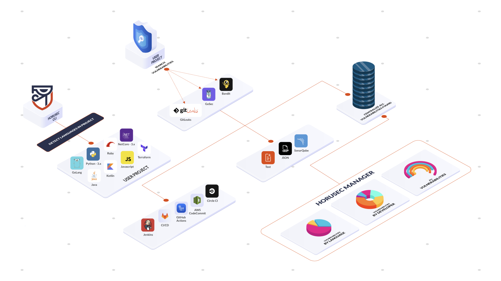
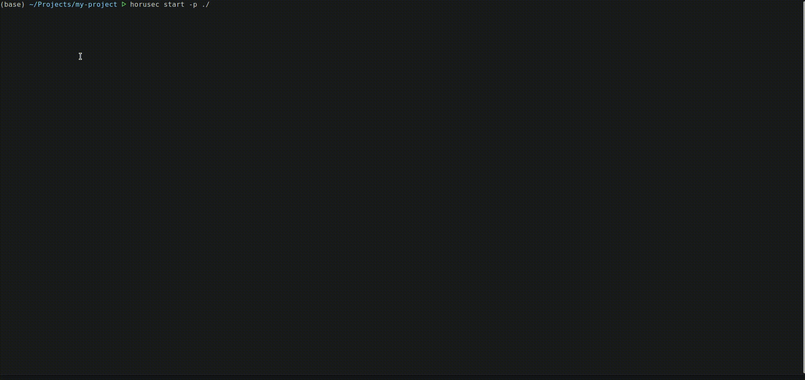

<a href="https://github.com/ZupIT/horusec/releases"></a>
<a href="https://github.com/ZupIT/horusec/actions?query=branch%3Amaster+"></a>
[](https://opensource.org/licenses/Apache-2.0)

<p></p>
<p></p>
<p align="center" margin="20 0"></p>
<p></p>
<p></p>

# Table of Contents

 * [What is Horusec](#what-is-horusec)
 * [Project roadmap](#project-roadmap)
 * [Getting started](#getting-started)
 * [Installing](#installing)
 * [Usage](#usage)
      * [Requirements for usage horusec-cli](#requirements-for-usage-horusec-cli)
 * [Usage locally](#usage-locally)
      * [Default Development account](#default-development-account)
      * [Requirements for use complete horusec locally](#requirements-for-use-complete-horusec-locally)
 * [Horusec manager](#horusec-manager)
 * [Contributing](#contributing)
 * [Communication](#communication)
 * [Contributors](#contributors) 
 
 

## What is Horusec?
Horusec is a security tool that centralizes many security test into one result.
Currently, performance analysis consists of:
* Python(3.x) => ([Bandit][Bandit] and [Safety][Safety])
* Ruby => ([Brakeman][Brakeman])
* Javascript => ([Npm Audit][NpmAudit] and [Yarn Audit][YarnAudit])
* GoLang => ([Gosec][Gosec])
* .NetCore(3.x) => ([.NetCore][CodeSecuriyScan])
* Java => ([HorusecJava][HorusecJava])
* Kotlin => ([HorusecKotlin][HorusecKotlin])
* Terraform => ([Tfsec][Tfsec])
* Leaks => ([HorusecLeaks][HorusecLeaks])
* Leaks(optional search in git history) => ([GitLeaks][Gitleaks])

<p align="center" margin="20 0"></p>

### For more details see our [DOCUMENTATION](https://zup-products.gitbook.io/horusec)

## Project roadmap

We started the project to aggregate within our company, but as the search grew more and more we chose to apply good practices and open it up for everyone to collaborate with this incredible project.

In order to achieve our goals, we separated in some delivery phases:

- **Phase 0:** Analyze vulnerabilities locally and send results to the application to manage them in an analytical way and find points for improvement in the project
- **Phase 1:** SAST analysis of the Kotlin language (Q3)
- **Phase 2:** New visual identity (Q3)
- **Phase 3:** Ability to indicate a vulnerability as a false positive or accepted risk (Q3)
- **Phase 4:** MVP of the SAST analysis engine (Q4 / 2021)
- **Phase 5:** Integration with vulnerability management tools (Archery) (Q4 / 2021)
- **Phase 6:** Plugins in IDE's - Developing in your project and in real time to be able to see if there are any security flaws is very important for the developer. Saving a long time in code review. (Q4 / 2021)

## Getting started

## Installing
To see more details how install go to <a href="horusec-cli#installing">HERE</a>

#### Check the installation
```bash
horusec version
```

## Usage
For use horusec-cli and check your vulnerabilities
```bash
horusec start
```

or send with the authorization token to view the content analytically in the horusec admin panel.

```bash
horusec start -a="<YOUR_TOKEN_AUTHORIZATION>"
```
To acquire the authorization token and you can see your vulnerabilities analytically on our panel see more details <a href="horusec-cli#authorization">HERE</a>


**WARN:** When horusec starts an analysis it creates a folder called `.horusec`. This folder serves as the basis for not changing your code. So we recommend that you add the line `.horusec` into your `.gitignore` file so that this folder does not need to be sent to your git server!

<p align="center" margin="20 0"></p>

## Requirements for usage horusec-cli
* docker
* git(Mandatory if you are using search throughout the project's git history)

## Usage locally
For usage the horusec locally clone horusec in your local machine and run
```bash
make install
```
and run the [HORUSEC-CLI](horusec-cli#horusec-cli) to start the analysis

### Default Development account
For usage complete feature of the horusec you can see enter using this default user generated by horusec for you usage
```
  email: dev@horusec.com
  password: Devpass0*
```

### Requirements for use complete horusec locally
* docker
* git
* docker-compose/helm
* golang
* rabbitmq
* postgres
* account-of-email (optional)

## Horusec manager

* Separate repositories by companies
* Manage users who have access to your company (users must be pre-registered on horusec to be invited to a pre-existing company)
* Manage the repositories available in your company for analysis
* Manage users who have access to company repositories
* Manage your access tokens for the specific repository (required to identify which repository this analysis belongs to and save to our system)
* Visually view all existing vulnerabilities in your company and/or its repository

## Contributing

Read our [contributing guide](CONTRIBUTING.md) to learn about our development process, how to propose bugfixes and improvements, and how to build and test your changes to horusec.

## Communication

We have a few channels for contact, feel free to reach out to us at:

- [GitHub Issues](https://github.com/ZupIT/horusec/issues)

## Contributors

This project exists thanks to all the [contributors]((https://github.com/ZupIT/horusec/graphs/contributors)). You rock!   ❤️🚀

[Bandit]: https://github.com/PyCQA/bandit
[Safety]: https://github.com/pyupio/safety
[Brakeman]: https://github.com/presidentbeef/brakeman
[Gosec]: https://github.com/securego/gosec
[NpmAudit]: https://docs.npmjs.com/cli/audit
[YarnAudit]: https://yarnpkg.com/lang/en/docs/cli/audit/
[Gitleaks]: https://github.com/zricethezav/gitleaks
[HorusecKotlin]: https://github.com/ZupIT/horusec/tree/master/horusec-kotlin
[HorusecJava]: https://github.com/ZupIT/horusec/tree/master/horusec-java
[HorusecLeaks]: https://github.com/ZupIT/horusec/tree/master/horusec-leaks
[FindSec]: https://find-sec-bugs.github.io
[Tfsec]: https://github.com/liamg/tfsec
[CodeSecuriyScan]: https://security-code-scan.github.io/


